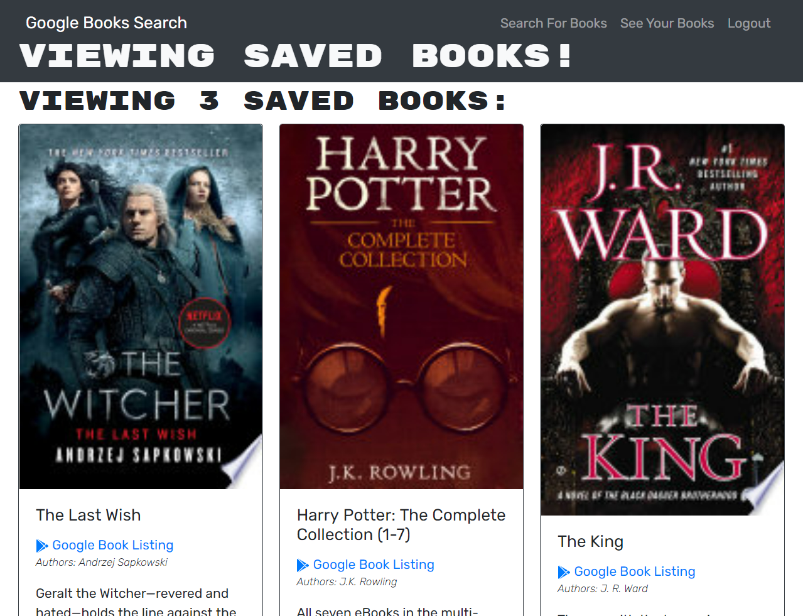

# Book Search Engine
This challenge for Module 21 of the Coding Bootcamp is to refactor a fully functioning Google Books API search engine built with a RESTful API to be a GraphQL API built with Apollo Server. 

* [Book Search Engine URL](#projectURL)

* [Future Plans](#futurePlans)

* [Technologies Used](#techUsed)

* [What I Learned](#whatILearned)

* [Screenshot](#webImage)

* [Contact Me](#contactMe)

* [User Story](#userStory)

* [Requirements](#requirements)

---

## Book Search Engine URL
[Book Search Engine URL](https://book-search-bjackels5.herokuapp.com/)

---

## Future Plans

If I had more time before this is due and before I need to start working on project 3, I'd DRY out the SearchBooks and SavedBooks pages to have the book list as a separate component that they could each include. I'd also change a lot of the styling. I love Bootstrap for placing things where I want them to go, but I don't really like the default colors and styles.

I would also get everything working with the latest releases of all the included technology so I could get rid of all the deprecation warnings. Since the supplied starter code has deprection warnings, so does my project. 

I can see myself using this to track what books I own and which ones are on my wish list. Yes, I know I could use something like GoodReads to do that, but GoodReads doesn't work exactly how I want it to. Plus, it's not private by default. I'd add the ability to tag each book with read vs. unread, did I like it or not, and other stuff, too. I'd want to be able to search, filter, and sort my list by those tags. I'd also want to be able to export my lists to a spreadsheet or even just a csv. I could just do most of this with a spreadsheet, but I like being able to search the Google Books and then clicking a button to add it to my list.

---

## Technologies Used
* Apollo Server
* Apollo Provider
* GraphQL
* Mongo
* Express.js
* React
* Node
* React Router
* Heroku
* JWT
* concurrently npm package
* jsonwebtoken package
* jwt-decode
* faker
* nodemon

--- 

## I learned how to...

* Create an Apollo Server and apply it to an Express.js server as middleware.

* Modify the existing authentication middleware to work in the context of a GraphQL API.

* Create an Apollo Provider so that requests can communicate with an Apollo server.

* Build API endpoints with GraphQL in a MERN application.

* Use GraphQL queries and mutations to fetch and modify server-side data.

* Successfully configure and deploy a MERN application to Heroku.

* Explain the difference between GraphQL and RESTful APIs.

* Configure a proxy server for local development of a MERN application.

* Implement client-side routing using React Router.

* Implement authentication with JWT.

---

## Screenshot

---

## Contact Me
You can reach me, Brenda Jackels, at bjackels5@gmail.com.

---

## User Story

### AS AN avid reader
### I WANT to search for new books to read
### SO THAT I can keep a list of books to purchase

--- 

## Requirements

* Set up an Apollo Server to use GraphQL queries and mutations to fetch and modify data, replacing the existing RESTful API.

* Modify the existing authentication middleware so that it works in the context of a GraphQL API.

* Create an Apollo Provider so that requests can communicate with an Apollo Server.

* Deploy the application to Heroku.
* When the search engine is loaded, the navigation bar shows two options:
    * Search for Books (selected by default)
    * Login / Submit
* When Search for Books is selected, the user sees an input field to search for books and a submit button.
* Searching for books will result in several search results, featuring the following information about each book:
    * title
    * author
    * description
    * image
    * a link to that book on the Google Books site
    * if the user is logged in, there will be a Save button for each book. Clicking that button will save the book's information to the user's account.
* When Login / Signup is selected, a modal appears with a toggle between log in and sign up.
    * When the toggle is set to Signup:
        * the user will see a signup button and three input fields:
            * username
            * email address
            * password
        * when the user enters a valid email address and a valid password and then clicks on the signup button, the user account is created, the modal closes, and the user is logged into the website
    * When the toggle is set to Login:
        * the user will see a login button and input fields for an emal address and password
        * after entering an email address and password of an existing account, the modal closes and and the user is logged into the site
* When the user is logged into the site, the navigation bar options change to:
    * Search for Books
    * Saved Books
    * Logout
* When the user clicks Saved Books, they see all the books they have saved to their account, each including all the information displayed in Search Results. The user will also see a Remove button on each book. Clicking that button will delete the book's information from the user's account.
* Clicking the logout button will log the user out of the site. They will then be presented with the navigation bar as described earlier for users not logged in.

* Back-end Refactoring:
    * auth.js: Update the auth middleware function to work with the GraphQL API.
    * server.js: Implement the Apollo Server and apply it to the Express server as middleware.
    * Schemas directory:
        * index.js: Export your typeDefs and resolvers.
        * resolvers.js: Define the query and mutation functionality to work with the Mongoose models.
        *  typeDefs.js: Define the necessary Query and Mutation types:

            * Query type:

                * me: Which returns a User type.
            * Mutation type:

                * login: Accepts an email and password as parameters; returns an Auth type.

                * addUser: Accepts a username, email, and password as parameters; returns an Auth type.

                * saveBook: Accepts a book author's array, description, title, bookId, image, and link as parameters; returns a User type.

                * removeBook: Accepts a book's bookId as a parameter; returns a User type.
            * User type:
                * _id
                * username
                * email
                * bookCount
                * savedBooks: an array of the Book type.
            * Book type:
                * bookId:  Not the _id, but the book's id value returned from Google's Book API.
                * authors: An array of strings -there may be more than one author.
                * description
                * title
                * image
                * link
            * Auth type:
                * token
                * user: References the User type.
    * Front-End Specifications
        * queries.js: This will hold the query GET_ME, which will execute the me query set up using Apollo Server.
        * mutations.js:
            * LOGIN_USER will execute the loginUser mutation set up using Apollo Server.
            * ADD_USER will execute the addUser mutation.
            * SAVE_BOOK will execute the saveBook mutation.
            * REMOVE_BOOK will execute the removeBook mutation.
        * App.js: Create an Apollo Provider to make every request work with the Apollo server.
        * SearchBooks.js:   
            * Use the Apollo useMutation() Hook to execute the SAVE_BOOK mutation in the handleSaveBook() function instead of the saveBook() function imported from the API file.
            * Make sure you keep the logic for saving the book's ID to state in the try...catch block!

        * SavedBooks.js:
            * Remove the useEffect() Hook that sets the state for UserData.
            * Instead, use the useQuery() Hook to execute the GET_ME query on load and save it to a variable named userData.
            * Use the useMutation() Hook to execute the REMOVE_BOOK mutation in the handleDeleteBook() function instead of the deleteBook() function that's imported from API file. (Make sure you keep the removeBookId() function in place!)

        * SignupForm.js:
            * Replace the addUser() functionality imported from the API file with the ADD_USER mutation functionality.

        * LoginForm.js:
            *  Replace the loginUser() functionality imported from the API file with the LOGIN_USER mutation functionality.

